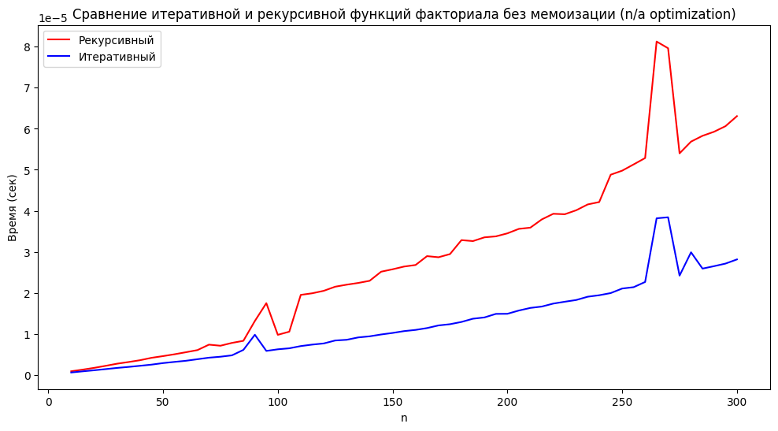
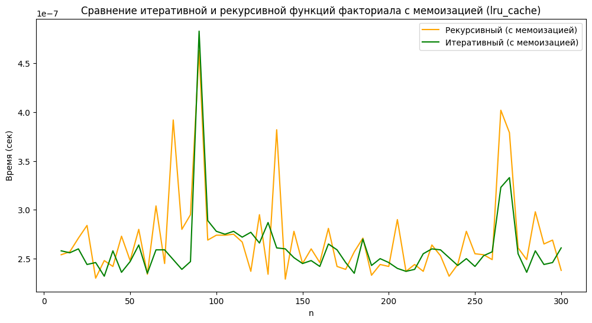

# Лабораторная работа №4: Сравнение работы функций. Профайлинг

### Цель работы
Сравнительный анализ итеративного и рекурсивного подходов к проектированию алгоритмов, а также изучение влияния кэширования результатов (мемоизации) на скорость выполнения функций в языке Python.

### Задание
1. Проектирование функций. Реализовать вычисление факториала четырьмя способами: итеративно и рекурсивно, как в стандартном виде, так и с применением оптимизации.
2. Оптимизация. Использовать декоратор @lru_cache из библиотеки functools для автоматического сохранения результатов вычислений.
3. Бенчмаркинг. Провести замеры времени выполнения для всех реализаций на числовом наборе данных от 10 до 300 с помощью модуля timeit.
4. Визуализация. Построить сравнительные графики зависимости времени работы от входного значения $n$ для наглядного анализа эффективности каждого метода.

### Реализация
```python
import timeit
import matplotlib.pyplot as plt
from functools import lru_cache
import sys

# Установка лимита рекурсии
sys.setrecursionlimit(2000)

# 1. Итеративный факториал без мемоизации
def fact_iterative(n: int) -> int:
    res = 1
    for i in range(1, n + 1):
        res *= i
    return res

# 2. Рекурсивный факториал без мемоизации
def fact_recursive(n: int) -> int:
    if n == 0:
        return 1
    return n * fact_recursive(n - 1)

# 3. Итеративный факториал с мемоизацией
@lru_cache(maxsize=None)
def fact_iterative_cached(n: int) -> int:
    res = 1
    for i in range(1, n + 1):
        res *= i
    return res

# 4. Рекурсивный факториал с мемоизацией
@lru_cache(maxsize=None)
def fact_recursive_cached(n: int) -> int:
    if n == 0:
        return 1
    return n * fact_recursive_cached(n - 1)

def benchmark(func, n, repeat=5):
    """Возвращает минимальное время выполнения func(n) за несколько повторов"""
    times = timeit.repeat(lambda: func(n), number=1, repeat=repeat, globals=globals())
    return min(times)

def main():
    # Фиксированный набор данных
    test_data = list(range(10, 301, 5))

    # Сбор результатов
    res_recursive = []
    res_iterative = []
    res_recursive_cached = []
    res_iterative_cached = []

    for n in test_data:
        # Без мемоизации
        try:
            res_recursive.append(benchmark(fact_recursive, n))
        except RecursionError:
            res_recursive.append(float('inf'))  # Установка бесконечности при ошибке

        res_iterative.append(benchmark(fact_iterative, n))

        # С мемоизацией
        res_recursive_cached.append(benchmark(fact_recursive_cached, n))
        res_iterative_cached.append(benchmark(fact_iterative_cached, n))


    # График 1: Без мемоизации
    plt.figure(figsize=(12, 6))
    plt.plot(test_data, res_recursive, label="Рекурсивный", color='red')
    plt.plot(test_data, res_iterative, label="Итеративный", color='blue')
    plt.xlabel("n")
    plt.ylabel("Время (сек)")
    plt.title("Сравнение итеративной и рекурсивной функций факториала без мемоизации (n/a optimization)")
    plt.legend()
    plt.show()

    # График 2: С мемоизацией
    plt.figure(figsize=(12, 6))
    plt.plot(test_data, res_recursive_cached, label="Рекурсивный (с мемоизацией)", color='orange')
    plt.plot(test_data, res_iterative_cached, label="Итеративный (с мемоизацией)", color='green')
    plt.xlabel("n")
    plt.ylabel("Время (сек)")
    plt.title("Сравнение итеративной и рекурсивной функций факториала с мемоизацией (lru_cache)")
    plt.legend()
    plt.show()

if __name__ == "__main__":
    main()
```

### Визуализация результатов

#### График без мемоизации
На данном графике виден значительный рост времени выполнения при увеличении входного параметра $n$ для стандартных функций.

* Итеративный метод (синяя линия): показывает стабильный, практически линейный рост времени выполнения при увеличении $n$. 

* Рекурсивный метод (красная линия): демонстрирует более высокую скорость роста времени и нестабильность. 

График показывает накладные расходы рекурсии - затраты времени на управление стеком вызовов делают этот метод менее эффективным по сравнению с обычным циклом при отсутствии оптимизации.


#### График с мемоизацией (lru_cache)
Этот график демонстрирует влияние кэширования результатов на производительность алгоритмов:

* Масштаб времени: первое ключевое отличие — резкое изменение порядка величин на оси $Y$. Время выполнения снизилось с $10^{-5}$ до $10^{-7}$ секунд (ускорение примерно в 100 раз).

* Итеративный и рекурсивный методы (зеленая и оранжевая линии): обе кривые практически сливаются в одну и теряют выраженный линейный характер роста. Вместо этого наблюдаются хаотичные колебания на сверхнизких значениях времени.

График иллюстрирует эффект мемоизации. Она устраняет повторные вычисления и делает функции почти одинаково быстрыми.


### Оценка времени выполнения без использования кэширования (1млн запусков)

```python
import timeit

# Итеративная функция (миллион вызовов)
t_iter = timeit.timeit("fact_iterative(10)", setup="from __main__ import fact_iterative", number=1000000)
print(f"Итеративная (без кэша): {t_iter:.5f} сек")

# Рекурсивная функция (миллион вызовов)
t_rec = timeit.timeit("fact_recursive(10)", setup="from __main__ import fact_recursive", number=1000000)
print(f"Рекурсивная (без кэша): {t_rec:.5f} сек")
```

* Итеративная (без кэша): 0.84893 сек

* Рекурсивная (без кэша): 0.79689 сек

### Оценка времени выполнения с использованием кэширования (1млн запусков)

```python
from functools import lru_cache
import timeit

# Итеративная функция с кэшем
t_iter_c = timeit.timeit("fact_iterative_cached(10)", setup="from __main__ import fact_iterative_cached", number=1000000)
print(f"Итеративная (с кэшем): {t_iter_c:.5f} сек")

# Рекурсивная функция с кэшем
t_rec_c = timeit.timeit("fact_recursive_cached(10)", setup="from __main__ import fact_recursive_cached", number=1000000)
print(f"Рекурсивная (с кэшем): {t_rec_c:.5f} сек")
```

* Итеративная (с кэшем): 0.00838 сек

* Рекурсивная (с кэшем): 0.00714 сек

### Вывод
Был проведен сравнительный анализ производительности итеративного и рекурсивного алгоритмов. Без оптимизации итеративный метод показал стабильный линейный рост ($O(n)$), в то время как рекурсия продемонстрировала более высокие временные затраты и нестабильность из-за накладных расходов на управление стеком вызовов.

Применение мемоизации через @lru_cache радикально изменило показатели: замеры с помощью timeit подтвердили, что время выполнения сократилось на два порядка (в 100 раз) — с 0.8 сек до 0.008 сек за миллион итераций. Кэширование нивелировало недостатки рекурсии, сделав оба подхода одинаково эффективными за счет исключения повторных вычислений. 

Это подтвердило, что мемоизация является важным инструментом для оптимизации алгоритмов с повторяющимися подзадачами.