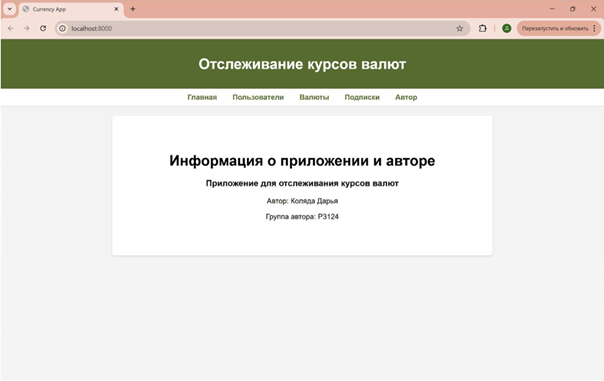
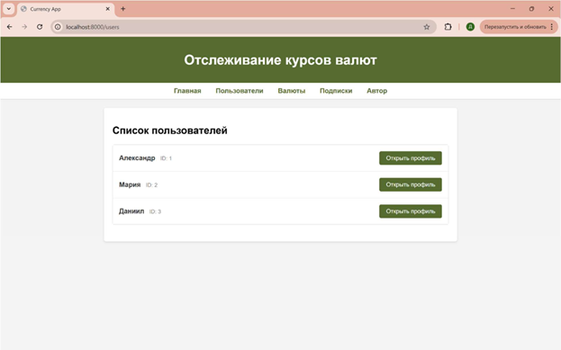
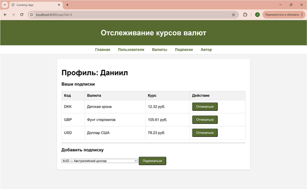
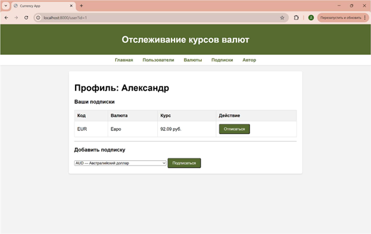
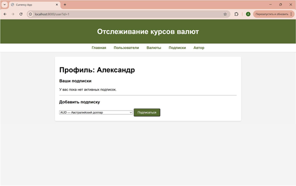
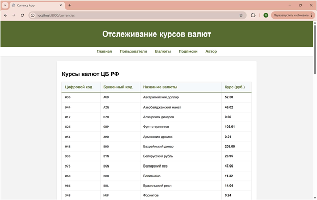
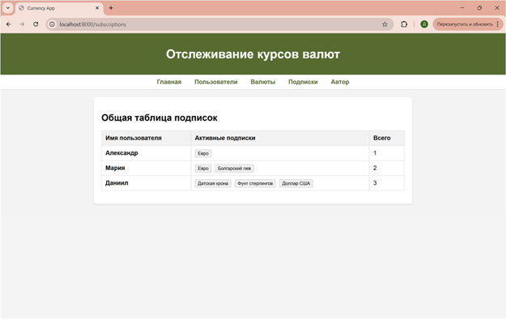
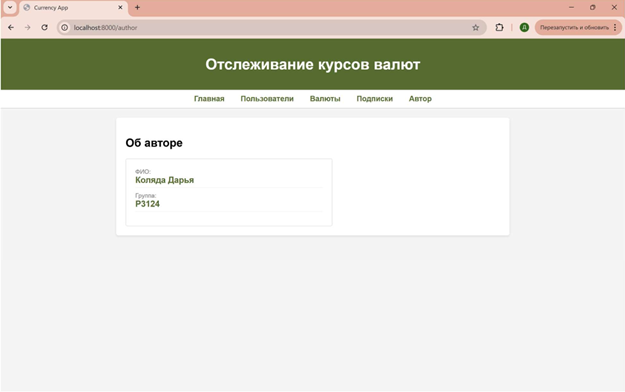

# Лабораторная работа №9: CRUD для приложения отслеживания курсов валют c SQLite базой данных

### Цель работы
1. Реализовать CRUD для сущностей бизнес-логики приложения.
2. Освоить работу с SQLite в памяти (:memory:) через модуль sqlite3.
3. Понять принципы первичных и внешних ключей и их роль в связях между таблицами.
4. Выделить контроллеры для работы с БД и для рендеринга страниц в отдельные модули.
5. Использовать архитектуру MVC и соблюдать разделение ответственности.
6. Отображать пользователям таблицу с валютами, на которые они подписаны.
7. Реализовать полноценный роутер, который обрабатывает GET-запросы и выполняет сохранение/обновление данных и рендеринг страниц.
8. Научиться тестировать функционал на примере сущностей currency и user с использованием unittest.mock.

### Задания
1. CRUD для Currency:
    * Create — добавление новых валют в базу данных;
    * Read — вывод валют из базы данных; 
    * Update — обновление значения курса валюты;
    * Delete — удаление валюты по id.
2. Работа с SQLite: использовать базу в памяти (sqlite3.connect(':memory:')).

### Реализация

### Структура проекта

??? info "Описание"

    currenciesapp/

      * controllers/	# Логика управления приложением

         * currency_controller.py

         * user_controller.py

         * database_controller.py

         * subscription_controller.py

      * db/	# Работа с БД

         * database.py

         * models/	# Описание сущностей

         * author.py

         * currency.py

         * user.py

      * templates/	# HTML-шаблоны (Jinja2)

         * author.html

         * base.html

         * currencies.html

         * index.html

         * subscriptions.html

         * user.html

         * users.html

      * tests/	# Тесты (unittest)

         * test_controller_currency.py

         * test_controller_database.py

         * test_controller_subscription.py

      * utils/	# Используемые функции

         * currencies_api.py

      * myapp.py	# Точка входа в приложение

      * app.db	# Файл базы данных
   

**Код myapp.py:**
```python
from http.server import HTTPServer, BaseHTTPRequestHandler
from urllib.parse import urlparse, parse_qs
from jinja2 import Environment, FileSystemLoader, select_autoescape
from models.author import Author
from controllers.database_controller import DatabaseController
from controllers.currency_controller import CurrencyController
from controllers.user_controller import UserController
from controllers.subscription_controller import SubscriptionController
from utils.currencies_api import get_currencies as fetch_api_currencies

# Инициализация
db = DatabaseController()
user_controller = UserController(db)
currency_controller = CurrencyController(db)
sub_controller = SubscriptionController(db)

author = Author("Коляда Дарья", "P3124")
env = Environment(loader=FileSystemLoader("templates"), autoescape=select_autoescape())

# Наполнение данными при первом запуске
if not user_controller.list_users():
    user_controller.create("Александр")
    user_controller.create("Мария")
    user_controller.create("Даниил")

if not currency_controller.list_currencies():
    try:
        api_data = fetch_api_currencies()
        for c in api_data:
            db.add_currency(c)
        print(f"Загружено {len(api_data)} валют.")
    except Exception as e:
        print(f"Ошибка API: {e}")

class MyServer(BaseHTTPRequestHandler):
    def send_html(self, html):
        self.send_response(200)
        self.send_header("Content-type", "text/html; charset=utf-8")
        self.end_headers()
        self.wfile.write(html.encode("utf-8"))

    def do_GET(self):
        parsed_path = urlparse(self.path)
        path = parsed_path.path
        params = parse_qs(parsed_path.query)

        if path == "/":
            self.send_html(env.get_template("index.html").render(author=author))
        elif path == "/users":
            users = user_controller.list_users()
            self.send_html(env.get_template("users.html").render(users=users, author=author))
        elif path == "/user":
            user_id = int(params.get("id", [0])[0])
            user = user_controller.get_user(user_id)
            if user:
                subs = sub_controller.get_user_subscriptions(user_id)
                all_cur = currency_controller.list_currencies()
                sub_ids = [s.id for s in subs]
                self.send_html(env.get_template("user.html").render(
                    user=user, subscriptions=subs, currencies=all_cur,
                    subscribed_ids=sub_ids, author=author))
        elif path == "/currencies":
            currencies = currency_controller.list_currencies()
            self.send_html(env.get_template("currencies.html").render(currencies=currencies, author=author))
        elif path == "/author":
            self.send_html(env.get_template("author.html").render(author=author))
        elif path == "/subscriptions":
            data = sub_controller.get_all_users_with_subscriptions()
            self.send_html(env.get_template("subscriptions.html").render(
                data=data,
                author=author
            ))
        else:
            self.send_error(404, "Not Found")

    def do_POST(self):
        length = int(self.headers.get('Content-Length', 0))
        body = self.rfile.read(length).decode()
        params = parse_qs(body)

        user_id = int(params.get('user_id', [0])[0])
        currency_id = params.get('currency_id', [''])[0]

        if self.path == "/subscribe":
            sub_controller.subscribe(user_id, currency_id)

        elif self.path == "/unsubscribe":
            sub_controller.unsubscribe(user_id, currency_id)

        self.send_response(302)
        self.send_header('Location', f'/user?id={user_id}')
        self.end_headers()

if __name__ == "__main__":
    web_server = HTTPServer(("localhost", 8000), MyServer)
    print("Сервер запущен: http://localhost:8000")
    web_server.serve_forever()
```

### Скриншоты страниц сайта

* Главная страница


* Список пользователей


* Страница пользователя



* Удаление подписки


* Список валют


* Подписки пользователей


* Страница об авторе


### Вывод
При разработке приложения была использована архитектура MVC, которая разделяет данные, логику и интерфейс.
Это позволило организовать код так, что изменения внешнего вида страниц не повлияет на логику обработки валют.
Работа с данными реализована через SQLite. 
В базе данных хранятся сведения о пользователях, валютах и их связях.
Запросы к базе построены так, что информация обновляется без создания дубликатов, связи между таблицами позволяют выводить индивидууальные списки подписок.
Приложение обрабатывает маршруты, направляя пользователя на нужные страницы: главная, списки валют, профиль, информация об авторе.
Для формирования страниц использован рендеринг шаблонов. Шаблонизатор позволяет вставлять данные из базы в HTML-код и использовать общие блоки для всех разделов сайта.
Это обеспечило единообразие интерфейса и кнопок управления.

### Ссылка на репозиторий
[Репозиторий проекта](https://github.com/kolyada-daria/py_itmo/tree/master/lab9)