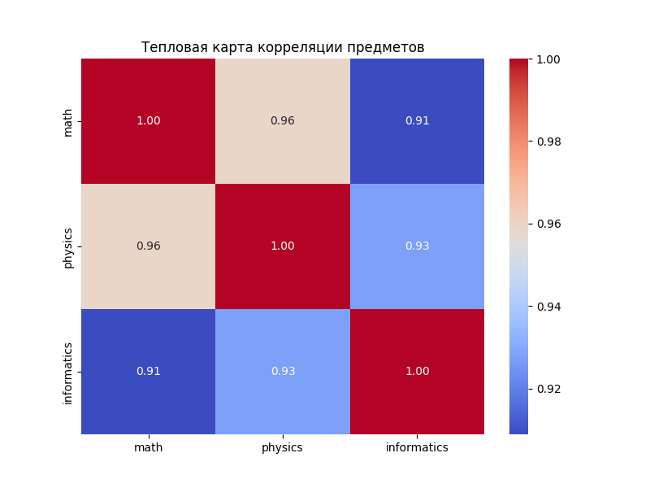
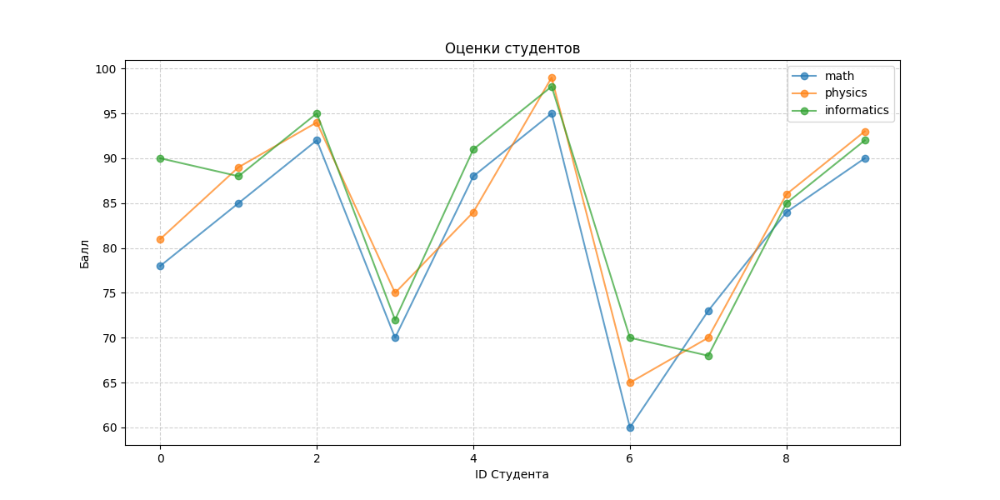
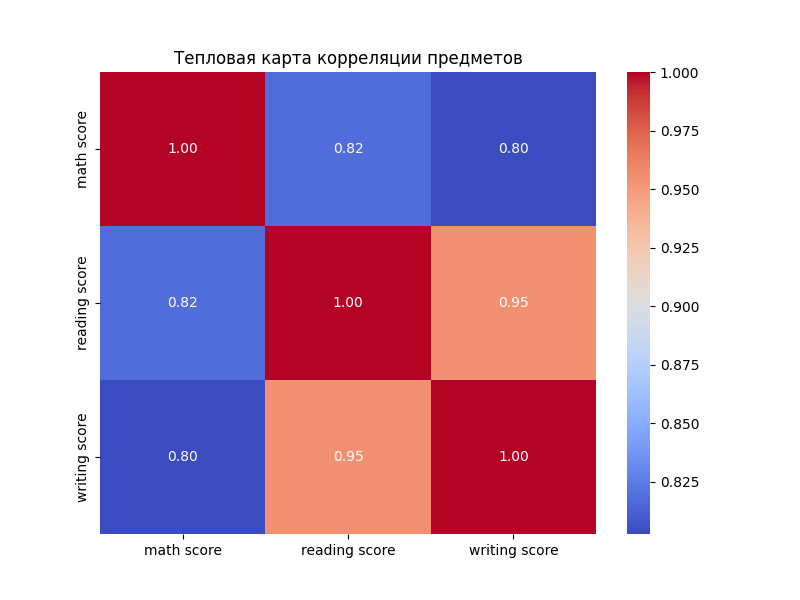
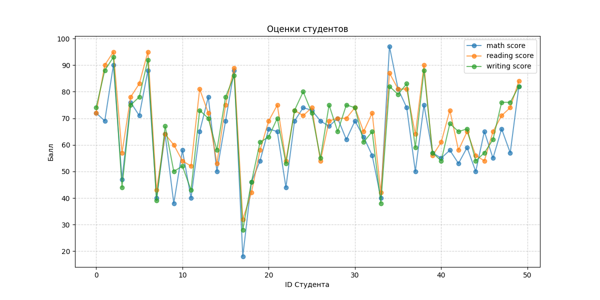
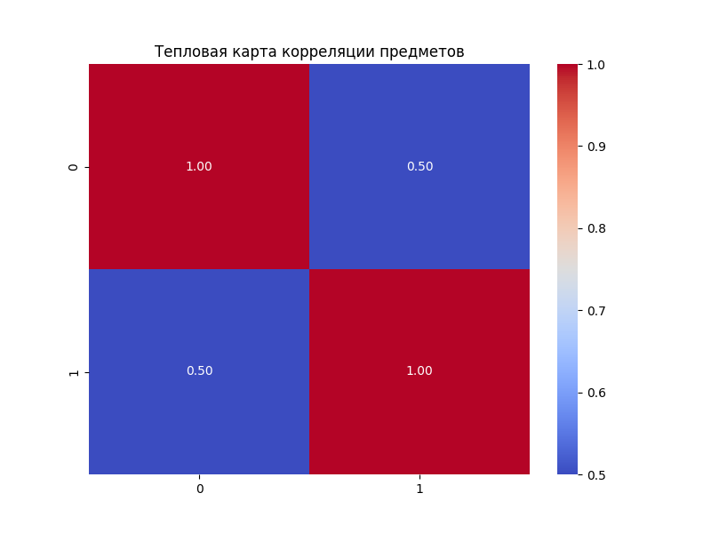
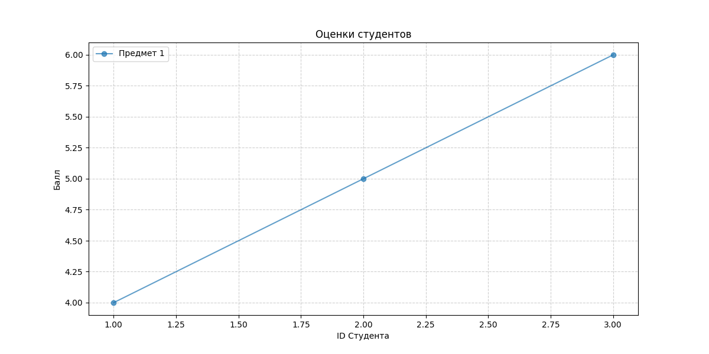
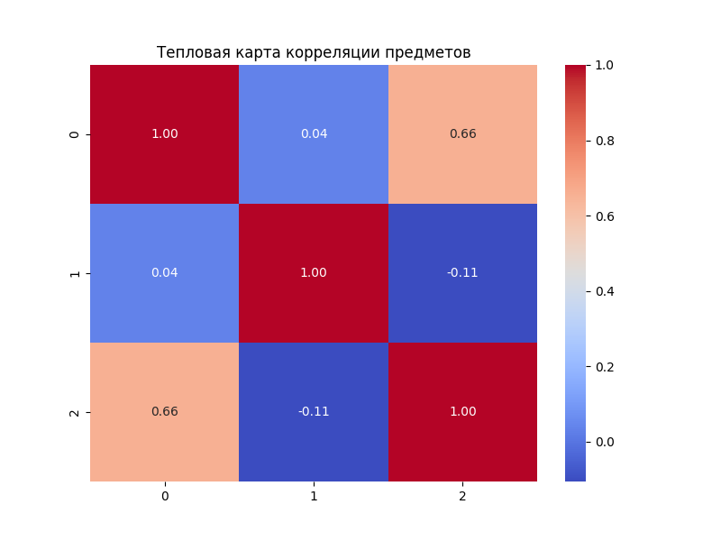
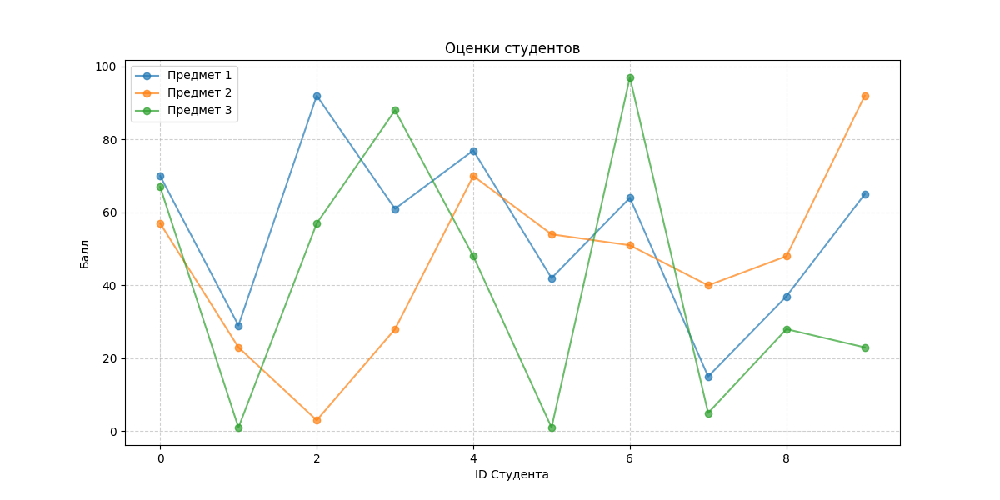
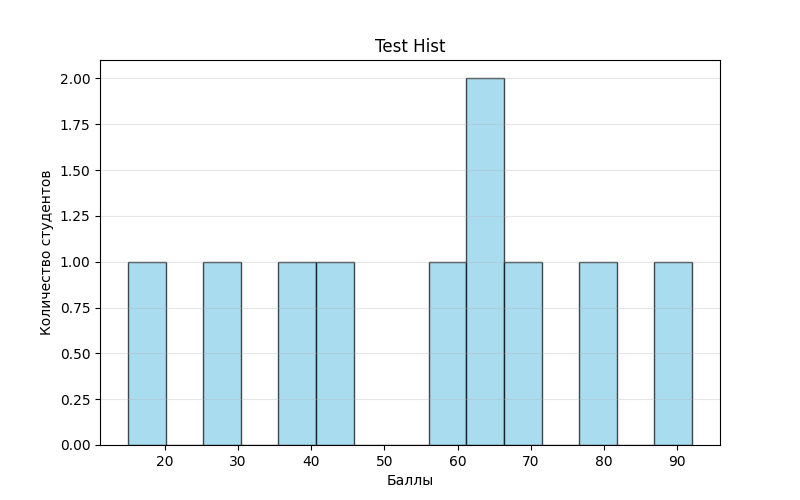

# Лабораторная работа №2: Численные вычисления и анализ данных с использованием NumPy

### Цель
Научиться работать с данными в Python: загружать таблицы, проводить математические расчеты и строить наглядные графики.

### Задачи
Создать систему из нескольких файлов, которая:

* Умеет выполнять базовые операции с матрицами и векторами (умножение, поиск определителя).

* Загружает реальные данные об оценках студентов из CSV-файла.

* Считает статистику: средний балл, медиану, разброс оценок и др.

* Рисует графики (гистограммы, тепловые карты и т.д.), чтобы увидеть закономерности в оценках.

### Реализация
Весь код разделен на логические части:

* Математика (main.py). Здесь находятся функции для расчетов и графиков. В них добавлены аннотации (подсказки типов).

* Скрипт анализа (run_analysis.py). Эта программа берет файл с оценками, находит в нем колонки с баллами и запускает расчеты.

* Тесты (test.py, test_run_analysis.py).

??? info "Показать полный код main.py"
    
    ```python

    import os  # Модуль для работы с операционной системой (создание папок, проверка путей)
    import numpy as np  # Основная библиотека для вычислений (массивы, матрицы)
    import pandas as pd  # Библиотека для работы с таблицами (чтение CSV)
    import seaborn as sns  # Для тепловых карт
    from typing import Dict, Union, List, Optional
    import matplotlib
    # Чтобы в тестах не появлялись всплывающие окна
    matplotlib.use('Agg')
    import matplotlib.pyplot as plt
    
    
    # Создаем папку для графиков, если её нет
    # 'exist_ok=True' предотвращает ошибку, если папка уже есть
    os.makedirs("plots", exist_ok=True)
    
    
    # ============================================================
    # 1. СОЗДАНИЕ И ОБРАБОТКА МАССИВОВ
    # ============================================================
    
    def create_vector() -> np.ndarray:
        """
        Создание массива от 0 до 9.
        Использует np.arange, который работает как встроенный range(), но возвращает ndarray.
        Returns:
            numpy.ndarray: массив чисел от 0 до 9 включительно
        """
        return np.arange(10)
    
    
    def create_matrix()-> np.ndarray:
        """
        Создание матрицы 5x5 со случайными числами в диапазоне [0,1].
        Returns:
            numpy.ndarray: матрица 5x5 со случайными значениями от 0 до 1
        """
        return np.random.rand(5, 5)
    
    
    def reshape_vector(vec: np.ndarray) -> np.ndarray:
        """
        Преобразование (10,) -> (2,5).
        Изменяет форму массива без изменения его данных.
        Преобразует вектор из 10 элементов в матрицу 2 строки на 5 столбцов.
        Args:
            vec (numpy.ndarray): входной массив формы (10,)
        Returns:
            numpy.ndarray: преобразованный массив формы (2, 5)
        """
        return vec.reshape(2, 5)
    
    
    def transpose_matrix(mat: np.ndarray) -> np.ndarray:
        """
        Транспонирование матрицы.
        Args:
            mat (np.ndarray): входная матрица.
        Returns:
            numpy.ndarray: транспонированная матрица
        """
        return mat.T
    
    
    # ============================================================
    # 2. ВЕКТОРНЫЕ ОПЕРАЦИИ
    # ============================================================
    
    def vector_add(a: np.ndarray, b: np.ndarray) -> np.ndarray:
        """
        Сложение векторов одинаковой длины (векторизация без циклов).
        Каждый элемент a[i] складывается с b[i].
        Args:
            a (numpy.ndarray): первый вектор
            b (numpy.ndarray): второй вектор
        Returns:
            numpy.ndarray: результат поэлементного сложения
        """
        return a + b
    
    
    def scalar_multiply(vec: np.ndarray, scalar: Union[float, int]) -> np.ndarray:
        """
        Умножение вектора на число: каждый элемент массива умножается на скаляр.
        Args:
            vec (numpy.ndarray): входной вектор
            scalar (float/int): число для умножения
        Returns:
            numpy.ndarray: результат умножения вектора на скаляр
        """
        return vec * scalar
    
    
    def elementwise_multiply(a: np.ndarray, b: np.ndarray) -> np.ndarray:
        """
        Поэлементное умножение.
        Args:
            a (numpy.ndarray): первый вектор/матрица
            b (numpy.ndarray): второй вектор/матрица
        Returns:
            numpy.ndarray: результат поэлементного умножения
        """
        return a * b
    
    
    def dot_product(a: np.ndarray, b: np.ndarray) -> float:
        """
        Скалярное произведение.
        Args:
            a (numpy.ndarray): первый вектор
            b (numpy.ndarray): второй вектор
        Returns:
            float: скалярное произведение векторов
        """
        return np.dot(a, b)
    
    
    # ============================================================
    # 3. МАТРИЧНЫЕ ОПЕРАЦИИ
    # ============================================================
    
    def matrix_multiply(a: np.ndarray, b: np.ndarray) -> np.ndarray:
        """
        Умножение матриц.
        Args:
            a (numpy.ndarray): первая матрица
            b (numpy.ndarray): вторая матрица
        Returns:
            numpy.ndarray: результат умножения матриц
        """
        return a @ b
    
    
    def matrix_determinant(a: np.ndarray) -> float:
        """
        Определитель матрицы.
        Args:
            a (numpy.ndarray): квадратная матрица
        Returns:
            float: определитель матрицы
        """
        return np.linalg.det(a)
    
    
    def matrix_inverse(a: np.ndarray) -> np.ndarray:
        """
        Обратная матрица.
        Args:
            a (numpy.ndarray): квадратная матрица
        Returns:
            numpy.ndarray: обратная матрица
        """
        return np.linalg.inv(a)
    
    
    def solve_linear_system(a: np.ndarray, b: np.ndarray) -> np.ndarray:
        """
        Решение системы Ax = b.
        Args:
            a (numpy.ndarray): матрица коэффициентов A
            b (numpy.ndarray): вектор свободных членов b
        Returns:
            numpy.ndarray: решение системы x
        """
        return np.linalg.solve(a, b)
    
    
    # ============================================================
    # 4. СТАТИСТИЧЕСКИЙ АНАЛИЗ
    # ============================================================
    
    def load_dataset(path="data/students_scores.csv")-> np.ndarray:
        """
        Загрузить CSV и вернуть NumPy массив.
        Использует Pandas для чтения и .to_numpy() для конвертации в массив NumPy.
        Args:
            path (str): путь к CSV файлу
        Returns:
            numpy.ndarray: загруженные данные в виде массива
        """
        if not os.path.exists(path):
            # Если файла нет, создаем его для корректной работы
            os.makedirs(os.path.dirname(path), exist_ok=True)
            with open(path, "w") as f:
                f.write(
                    "math,physics,informatics\n78,81,90\n85,89,88\n92,94,95\n70,75,72\n88,84,91\n95,99,98\n60,65,70\n73,70,68\n84,86,85\n90,93,92")
    
        df = pd.read_csv(path)
        return df.to_numpy()
    
    
    def statistical_analysis(data: np.ndarray) -> Dict[str, Union[float, np.ndarray]]:
        """
        Словарь со статистическими показателями.
        Вычисляет основные статистические метрики для набора данных.
        Автоматически определяет: считать по одному столбцу или по всем сразу.
        Нужно оценить:
            - средний балл
            - медиану
            - стандартное отклонение
            - минимум
            - максимум
            - 25 и 75 перцентили
        Args:
            data (numpy.ndarray): одномерный массив данных
        Returns:
            Dict[str, Union[float, np.ndarray]]: словарь с метриками (mean, std, median и т.д.).    """
        # Определяем ось: если массив двумерный (таблица), считаем по столбцам (axis=0)
        # Если одномерный (тесты), считаем по всему массиву (axis=None)
        ax = 0 if data.ndim > 1 else None
        return {
            "mean": np.mean(data, axis=ax),                         # Среднее арифметическое (средний балл)
            "median": np.median(data, axis=ax),                     # Медиана (середина отсортированного списка)
            "std": np.std(data, axis=ax),                           # Стандартное отклонение (разброс данных)
            "min": np.min(data, axis=ax),                           # Минимальное значение
            "max": np.max(data, axis=ax),                           # Максимальное значение
            "percentile_25": np.percentile(data, 25, axis=ax),   # 25% результатов ниже этого значения
            "percentile_75": np.percentile(data, 75, axis=ax)    # 75% результатов ниже этого значения
        }
    
    
    def normalize_data(data: np.ndarray) -> np.ndarray:
        """
        Min-Max нормализация данных.
        Формула: (x - min) / (max - min)
        Args:
            data (numpy.ndarray): входной массив данных
        Returns:
            numpy.ndarray: нормализованный массив данных в диапазоне [0, 1]
        """
        data_min = np.min(data)
        data_max = np.max(data)
        return (data - data_min) / (data_max - data_min)
    
    
    # ============================================================
    # 5. ВИЗУАЛИЗАЦИЯ
    # ============================================================
    
    def plot_histogram(data: np.ndarray, title: str = "Распределение оценок") -> None:
        """
        Строит и сохраняет гистограмму распределения данных.
        Args:
            data (numpy.ndarray): данные для гистограммы
            title (str): заголовок графика и часть имени файла.
        """
        plt.figure(figsize=(8, 5))
        plt.hist(data, bins=15, color='skyblue', edgecolor='black', alpha=0.7, label='Количество студентов')
        plt.title(title)
        plt.xlabel("Баллы")
        plt.ylabel("Количество студентов")
        plt.grid(axis='y', alpha=0.3)
    
        # Создаем имя файла на основе заголовка (заменяем пробелы на подчеркивания)
        file_name = str(title).lower().replace(" ", "_")
        os.makedirs("plots", exist_ok=True)
        plt.savefig(f"plots/{file_name}.png")
        plt.close() # Закрываем график, чтобы освободить оперативную память
    
    
    def plot_heatmap(matrix: np.ndarray, labels: Optional[List[str]] = None) -> None:
        """
        Строит тепловую карту корреляционной матрицы.
        Чем ярче цвет, тем сильнее связь между переменными.
        Args:
            matrix (numpy.ndarray): матрица корреляции
            labels (Optional[List[str]]): список названий столбцов для осей.
        Returns:
            None: результат сохраняется в папке 'plots/'
        """
        plt.figure(figsize=(8, 6))
    
        # Создаем словарь с базовыми настройками
        kwargs = {
            'annot': True,
            'cmap': 'coolwarm',
            'fmt': ".2f",
            'xticklabels': labels if labels is not None else True,
            'yticklabels': labels if labels is not None else True
        }
    
        # Распаковываем словарь в функцию (оператор **)
        sns.heatmap(matrix, **kwargs)
    
        plt.title("Тепловая карта корреляции предметов")
        plt.savefig("plots/heatmap.png")
        plt.close()
    
    
    def plot_line(x: np.ndarray, y: np.ndarray, labels: Optional[List[str]] = None) -> None:
        """
        График зависимости: студент -> оценка.
        Args:
            x (numpy.ndarray): номера студентов
            y (numpy.ndarray): оценки студентов
            labels (Optional[List[str]]): Легенда для каждой линии.
        """
        plt.figure(figsize=(12, 6))
    
        # Если y — это просто вектор (1D), превращаем его в 2D для универсальности цикла
        y_to_plot = y.reshape(-1, 1) if y.ndim == 1 else y
    
        # Если список названий не передан, создаем его автоматически по количеству столбцов
        if labels is None:
            labels = [f"Предмет {i + 1}" for i in range(y_to_plot.shape[1])]
    
        # Рисуем линии
        for i in range(y_to_plot.shape[1]):
            plt.plot(x, y_to_plot[:, i], marker='o', label=labels[i], alpha=0.7)
    
        plt.title("Оценки студентов")
        plt.xlabel("ID Студента")
        plt.ylabel("Балл")
        plt.legend()
        plt.grid(True, linestyle='--', alpha=0.6)
    
        os.makedirs("plots", exist_ok=True)
        plt.savefig("plots/line_plot.png")
        plt.close()
    
    
    if __name__ == "__main__":
        print("Запустите python3 -m pytest test.py -v для проверки лабораторной работы.")
    ```


??? info "Показать полный код run_analysis.py"
    
    ```python

    import numpy as np  # Основная библиотека для вычислений (массивы, матрицы)
    import pandas as pd  # Библиотека для работы с таблицами (чтение CSV)
    from main import statistical_analysis, plot_histogram, plot_line, plot_heatmap
    
    def main() -> None:
        """
        Основная точка входа в программу анализа данных.
    
        Выполняет полный цикл обработки:
            1. Загрузка данных из CSV.
            2. Автоматическое определение числовых колонок для анализа.
            3. Расчет статистических показателей.
            4. Генерация и сохранение визуализаций (гистограммы, тепловая карта, линейный график).
    
        Returns:
            None: функция не возвращает значений, результат работы сохраняется в папке 'plots/'.
        """
    
        # Загрузка данных
        #path = "data/students_scores.csv"
        path = "data/StudentsPerformance.csv"
        df = pd.read_csv(path)
    
        # Берем названия всех колонок, где есть слово 'score' или просто все колонки
        # Это позволит коду работать с любым файлом
        target_cols = df.select_dtypes(include=[np.number]).columns.tolist()
        scores_data = df[target_cols].to_numpy()
    
        # 1. Статистика по предметам
        stats = statistical_analysis(scores_data)
    
        # 2. Гистограммы
        for i, col_name in enumerate(target_cols):
            plot_histogram(scores_data[:, i], title=f"Распределение {col_name}")
    
        # 3. Тепловая карта
        corr_matrix = np.corrcoef(scores_data.T)
        plot_heatmap(corr_matrix, labels=target_cols)
    
        # 4. Линейный график
        num_students = min(50, scores_data.shape[0])
    
        plot_line(np.arange(num_students), scores_data[:num_students, :], labels=target_cols)
    
        return
    
    if __name__ == "__main__":
        main()
    ```


Для проверок работы кода были использованы CSV файлы.

Полученные графики:

1. Для первого файла students_scores.csv
    
    * Тепловая карта
    

    * Линейный график оценки/студент
    
    
    * Распределение оценок по информатике
    

    * Распределение оценок по математике
    

    * Распределение оценок по физике
    


2. Для второго файла StudentsPerformance.csv (с сайта kaggle.com)

    * Тепловая карта
    

    * Линейный график оценки/студент
    

    * Распределение оценок по математике
    

    * Распределение оценок по чтению
    

    * Распределение оценок по письму
    


### Тесты
??? info "Полный код тестов для main.py"

    ```python

    from main import *
    
    def test_create_vector():
        v = create_vector()
        assert isinstance(v, np.ndarray)
        assert v.shape == (10,)
        assert np.array_equal(v, np.arange(10))
    
    
    def test_create_matrix():
        m = create_matrix()
        assert isinstance(m, np.ndarray)
        assert m.shape == (5, 5)
        assert np.all((m >= 0) & (m < 1))
    
    
    def test_reshape_vector():
        v = np.arange(10)
        reshaped = reshape_vector(v)
        assert reshaped.shape == (2, 5)
        assert reshaped[0, 0] == 0
        assert reshaped[1, 4] == 9
    
    
    def test_vector_add():
        assert np.array_equal(
            vector_add(np.array([1,2,3]), np.array([4,5,6])),
            np.array([5,7,9])
        )
        assert np.array_equal(
            vector_add(np.array([0,1]), np.array([1,1])),
            np.array([1,2])
        )
    
    
    def test_scalar_multiply():
        assert np.array_equal(
            scalar_multiply(np.array([1,2,3]), 2),
            np.array([2,4,6])
        )
    
    
    def test_elementwise_multiply():
        assert np.array_equal(
            elementwise_multiply(np.array([1,2,3]), np.array([4,5,6])),
            np.array([4,10,18])
        )
    
    
    def test_dot_product():
        assert dot_product(np.array([1,2,3]), np.array([4,5,6])) == 32
        assert dot_product(np.array([2,0]), np.array([3,5])) == 6
    
    
    def test_matrix_multiply():
        A = np.array([[1,2],[3,4]])
        B = np.array([[2,0],[1,2]])
        assert np.array_equal(matrix_multiply(A,B), A @ B)
    
    
    def test_matrix_determinant():
        A = np.array([[1,2],[3,4]])
        assert round(matrix_determinant(A),5) == -2.0
    
    
    def test_matrix_inverse():
        A = np.array([[1,2],[3,4]])
        invA = matrix_inverse(A)
        assert np.allclose(A @ invA, np.eye(2))
    
    
    def test_solve_linear_system():
        A = np.array([[2,1],[1,3]])
        b = np.array([1,2])
        x = solve_linear_system(A,b)
        assert np.allclose(A @ x, b)
    
    
    def test_load_dataset():
        # Для теста создадим временный файл
        test_data = "math,physics,informatics\n78,81,90\n85,89,88"
        with open("test_data.csv", "w") as f:
            f.write(test_data)
        try:
            data = load_dataset("test_data.csv")
            assert data.shape == (2, 3)
            assert np.array_equal(data[0], [78,81,90])
        finally:
            os.remove("test_data.csv")
    
    
    def test_statistical_analysis():
        data = np.array([10,20,30])
        result = statistical_analysis(data)
        assert result["mean"] == 20
        assert result["min"] == 10
        assert result["max"] == 30
    
    
    def test_normalization():
        data = np.array([0,5,10])
        norm = normalize_data(data)
        assert np.allclose(norm, np.array([0,0.5,1]))
    
    
    def test_plot_histogram():
        # Просто проверяем, что функция не падает
        data = np.array([1,2,3,4,5])
        plot_histogram(data)
    
    
    def test_plot_heatmap():
        matrix = np.array([[1,0.5],[0.5,1]])
        plot_heatmap(matrix)
    
    
    def test_plot_line():
        x = np.array([1,2,3])
        y = np.array([4,5,6])
        plot_line(x, y)
    ```


Полученные графики:
* Тепловая карта


* Линейный график оценки/студент


* График распределения оценок


??? info "Полный код тестов для run_analysis.py"

    ```python

    import pytest
    import os
    import numpy as np
    from main import statistical_analysis, normalize_data
    
    
    # Фикстура для создания временных данных перед тестами
    @pytest.fixture
    def sample_data():
        return np.array([
            [10, 20, 30],
            [40, 50, 60],
            [70, 80, 90]
        ])
    
    
    # 1. Тест корректности расчетов статистики
    def test_statistics_values(sample_data):
        stats = statistical_analysis(sample_data)
    
        # Проверяем среднее для первого столбца (10+40+70)/3 = 40
        assert stats['mean'][0] == pytest.approx(40.0)
        # Проверяем максимум для второго столбца
        assert stats['max'][1] == 80
        # Проверяем, что в словаре есть все нужные ключи
        expected_keys = ["mean", "median", "std", "min", "max", "percentile_25", "percentile_75"]
        assert all(key in stats for key in expected_keys)
    
    
    # 2. Тест нормализации (Min-Max)
    def test_normalization_range(sample_data):
        norm = normalize_data(sample_data)
        assert np.min(norm) == 0.0
        assert np.max(norm) == 1.0
        assert norm.shape == sample_data.shape
    
    
    # 3. Проверка создания файлов графиков
    def test_plots_generation():
        # Создаем фиктивные данные для отрисовки
        from main import plot_histogram, plot_heatmap, plot_line
    
        test_data = np.random.randint(0, 100, (10, 3))
    
        # Чистим папку plots перед тестом, если она есть
        if os.path.exists("plots/test_hist.png"):
            os.remove("plots/test_hist.png")
    
        # Запускаем функции
        plot_histogram(test_data[:, 0], title="Test Hist")
        plot_heatmap(np.corrcoef(test_data.T))
        plot_line(np.arange(10), test_data)
    
        # Проверяем, появились ли файлы на диске
        assert os.path.exists("plots/test_hist.png")
        assert os.path.exists("plots/heatmap.png")
        assert os.path.exists("plots/line_plot.png")
    
    
    # 4. Тест обработки пустых или некорректных путей
    def test_load_dataset_missing_file():
        from main import load_dataset
        # Проверяем, что функция создает файл, если его нет
        path = "data/temp_test.csv"
        if os.path.exists(path):
            os.remove(path)
    
        data = load_dataset(path)
        assert data.size > 0
        assert os.path.exists(path)
        os.remove(path)
    ```


Полученные графики:

* Тепловая карта


* Линейный график оценки/студент


* График распределения оценок



### Нюансы при решении
В процессе работы возникло несколько технических сложностей:

* Конфликты в тестах. После добавления строгой типизации (labels: List[str]) старые тесты в test.py перестали запускаться. Это было решено через Optional параметры, что позволило сохранить поддержку старых тестов, при этом расширив возможности новых функций.

* Универсальность. Код настроен так, что он не выдает ошибок, если в таблице будет больше или меньше предметов. Он автоматически подстраивается под размер данных.

* Чтобы программа работала с любым CSV-файлом, была применена фильтрация select_dtypes(include=[np.number]). Это позволяет коду автоматически игнорировать текстовые колонки (имена, пол, группы) и брать для расчетов только численные оценки.

### Выводы
В ходе выполнения работы был создан универсальный инструмент для анализа данных, 
который обрабатывает таблицы с оценками и наглядно визуализирует результаты. 
Использование библиотек NumPy и Pandas позволило заменить сложные вычисления простыми командами.
Благодаря добавлению аннотаций типов и автоматических тестов, 
программа стала надежной и понятной для других разработчиков, 
а все расчеты в ней подтверждены на 100% корректностью выполнения тестов.