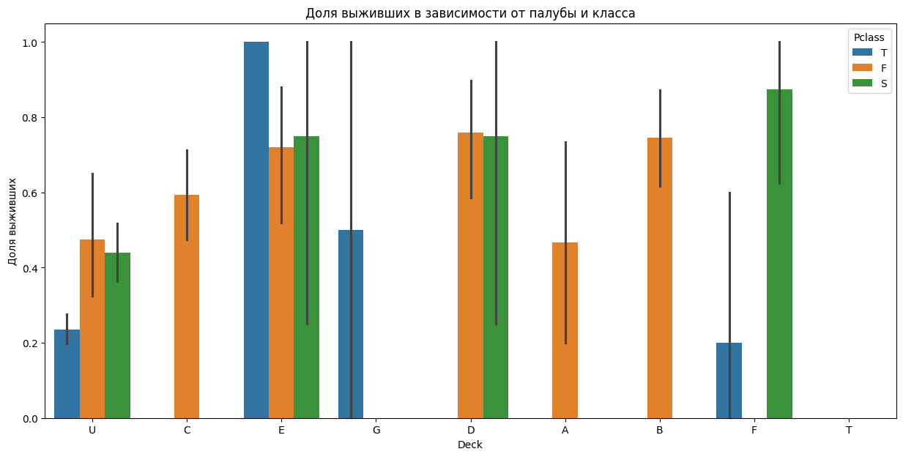
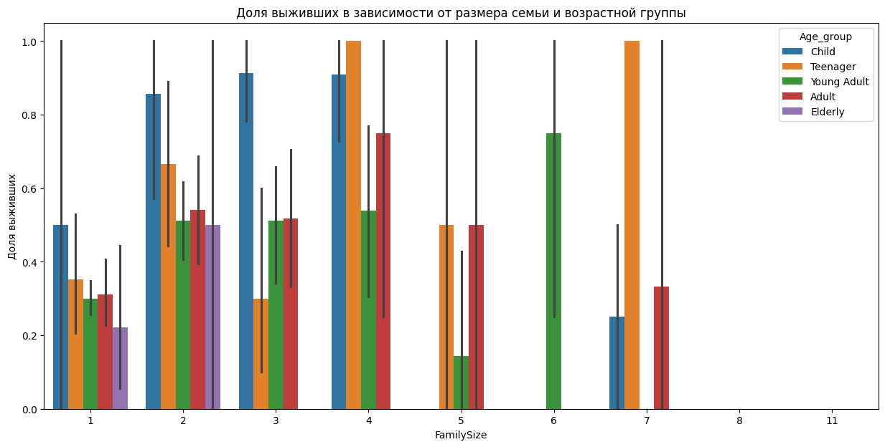
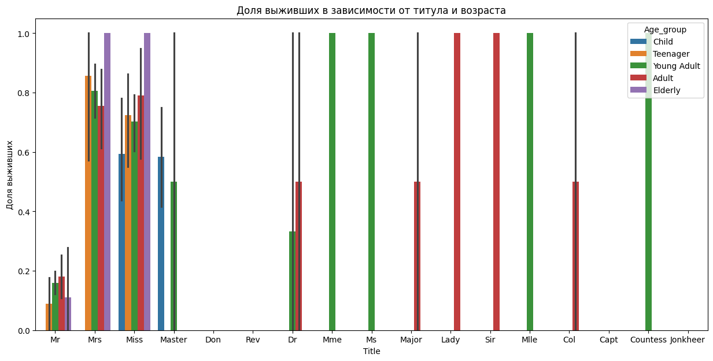
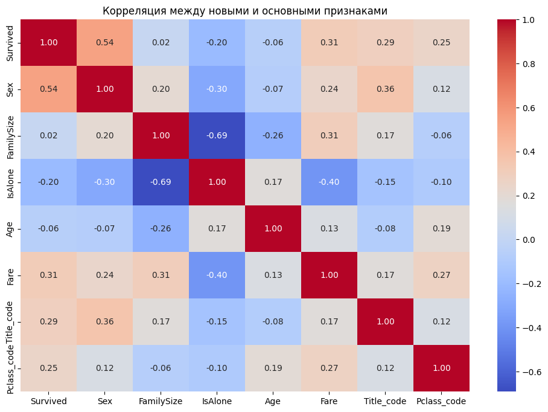

# Лабораторная работа №6: Очистка и трансформация данных.pandas

### Цель работы
Освоение методов очистки и трансформации данных с использованием библиотеки pandas на примере реальных данных из Kaggle.

### Задание

1. Первичный анализ данных

??? info "Подробнее"

    1. Загрузить данные из CSV-файла 
    2. Вывести первые 10 строк дата-фрейма 
    3. Проверить типы данных каждого столбца 
    4. Определить количество пропусков в каждом столбце 
    5. Получить статистические характеристики числовых признаков 
    6. Построить гистограммы распределения для числовых признаков

2. Обработка пропусков

??? info "Подробнее"

    1. Определить столбцы с пропусками
    2. Для столбца Age:
        - Посчитать среднее и медианное значение
        - Заполнить пропуски медианным значением
        - Создать новый признак Age_group на основе заполненного возраста
    3. Для столбца Embarked:
        - Определить наиболее часто встречающееся значение
        - Заполнить пропуски модой
    4. Для столбца Cabin:
        - Рассмотреть возможность удаления или создания нового признака на основе первой буквы

3. Работа с типами данных

??? info "Подробнее"

    1. Преобразовать Pclass в категориальный тип строкового значения (из числового - в строковое: 1 - F, 2 - S, 3 - T )
    2. Создать новый признак Title из столбца Name (мистер, миссис и т.д.)
    3. Преобразовать Sex в числовой формат (0/1)
    4. Создать признак FamilySize = SibSp + Parch + 1
    5. Создать признак IsAlone (1 если FamilySize = 1, иначе 0)

4. Удаление выбросов

??? info "Подробнее"

    1. Построить boxplot для признака Fare
    2. Определить выбросы с помощью IQR-метода
    3. Визуализировать распределение Age
    4. Применить winsorization для признака Fare (
    5. Заменить экстремальные значения на 95-й перцентиль (для Age)

5. Агрегация данных

??? info "Подробнее"

    1. Посчитать среднее выживание по классам
    2. Группировать данные по Pclass и Sex
    3. Посчитать медианный возраст по портам посадки
    4. Создать сводную таблицу выживаемости по новым признакам
    5. Сохранить очищенные данные в новый CSV-файл

6. Вычислить метрики качества очистки данных

??? info "Подробнее"

    1. Процент заполненных пропусков
    2. Количество уникальных значений в категориальных признаках
    3. Распределение значений после трансформации
    4. Корреляция между новыми признаками

### Реализация

[Ссылка на заполненный ipynb-борд](https://colab.research.google.com/drive/1vd_GUXy3J2XEtMiDi3yuAE8TWLmaVB5g?usp=sharing)

### Набор данных

[Используемый набор данных Titanic](https://www.kaggle.com/c/titanic/data)

Структура данных:

* PassengerId — идентификатор пассажира

* Survived — выжил ли пассажир (0 = нет; 1 = да)

* Pclass — класс билета

* Name — имя

* Sex — пол

* Age — возраст

* SibSp — количество братьев/сестер/супругов на борту

* Parch — количество родителей/детей на борту

* Ticket — номер билета

* Fare — стоимость билета

* Cabin — номер каюты

* Embarked — порт посадки

---

### Первичный анализ

#### Первая загрузка данных и просмотр их характеристик

```python

train = pd.read_csv(url_train)
train.info()

```
RangeIndex: 891 entries, 0 to 890
Data columns (total 12 columns):

| #  | Column      | Non-Null | Count      | Dtype    |
|:---|:------------|:---------|:-----------|:---------|
| 0  | PassengerId | 891      | non-null   | int64    |  
| 1  | Survived    | 891      | non-null   | int64    |
| 2  | Pclass      | 891      | non-null   | int64    |
| 3  | Name        | 891      | non-null   | object   |
| 4  | Sex         | 891      | non-null   | object   |
| 5  | Age         | 714      | non-null   | float64  |
| 6  | SibSp       | 891      | non-null   | int64    |
| 7  | Parch       | 891      | non-null   | int64    | 
| 8  | Ticket      | 891      | non-null   | object   |
| 9  | Fare        | 891      | non-null   | float64  |
| 10 | Cabin       | 204      | non-null   | object   |
| 11 | Embarked    | 889      | non-null   | object   |

dtypes: float64(2), int64(5), object(5)

#### Статистика датафрейма
В ходе выполнения заданий из файла был проведен первичный осмотр данных:

* Типы данных: обнаружено сочетание числовых (int64, float64) и объектных (object) типов.

* Основные характеристики: средний возраст пассажиров составил около 29.7 лет, а средняя стоимость билета — 32.20.

#### Пустые значения по столбцам
Был выявлен дефицит данных в трех столбцах:

* Age: ~20% пропусков.

* Cabin: >77% пропусков.

* Embarked: всего 2 пропущенных значения.

```python

train.isnull().sum()

```
#### Визуализация пропусков

|             | 0   |
|:------------|:----|
| PassengerId | 0   |
| Survived    | 0   |
| Pclass      | 0   |
| Name        | 0   |
| Sex         | 0   |
| Age         | 177 |
| SibSp       | 0   |
| Parch       | 0   |
| Ticket      | 0   |
| Fare        | 0   |
| Cabin       | 687 |
| Embarked    | 2   |

dtype: int64

---

### Обработка пропусков

#### Методы заполнения
Согласно заданию, были применены следующие подходы:

* Age - заполнение медианным значением (28.0), так как оно более устойчиво к выбросам, чем среднее.

* Embarked - заполнение модой (самым частым значением — 'S').

* Cabin - трансформация в признак Deck (первая буква каюты), пустые значения помечены как 'U' (Unknown).

```python
embarked_mode = train['Embarked'].mode()[0]
```
Самый частый: S

```python
train['Deck'] = train['Cabin'].str[0].fillna('U')
```
Обновленная структура Cabin:

| Deck    |     |
|:--------|:----|
| U       | 687 |
| C       | 59  |
| B       | 47  |
| D       | 33  |
| E       | 32  |
| A       | 15  |
| F       | 13  |
| G       | 4   |
| T       | 1   |
Name: count, dtype: int64

```python
embarked_age_median = train.groupby('Embarked')['Age'].median()
```
Медианный возраст по портам посадки:

| Embarked |       |
|:---------|:------|
| C        | 28.0  |
| Q        | 28.0  |
| S        | 28.0  |
Name: Age, dtype: float64


#### Результаты обработки
После обработки и удаления исходного столбца Cabin процент незаполненных данных был сведен к 0.00%.

```python
missing_after = train.isnull().sum().sum()
total_cells = train.size
completion_rate = ((missing_after / total_cells)) * 100
```
Процент не заполненных пропусков: 0.00%

---

### Трансформация данных

#### Созданные признаки
На этапе работы с типами данных были сгенерированы новые переменные.

* Title - извлечение титула из имени (например, Mr, Mrs, Miss) с использованием регулярных выражений.

* FamilySize - сумма родственников на борту (SibSp + Parch + 1).

* IsAlone - бинарный признак (1 — если пассажир один, 0 — если с семьей).

* Age_group - категоризация возраста (Child, Adult и т.д.).

#### Преобразования типов

* Sex переведен в числовой формат (0 для male, 1 для female).

* Pclass преобразован из чисел в строковые категории (F, S, T) для корректного анализа.

---

### Обработка выбросов

#### Выявленные выбросы
С помощью boxplot обнаружены экстремальные значения в признаке Fare. 
По методу IQR границы составили $[Q1 - 1.5 \cdot IQR, Q3 + 1.5 \cdot IQR]$.

#### Методы обработки
Winsorization: 

* Значения Fare выше 95-го перцентиля были приравнены к значению этого перцентиля.
* Экстремально высокие значения Age также заменены на 95-й перцентиль для сглаживания распределения.

---

### Агрегация и анализ

#### Сводные статистики
Использование pivot_table позволило выявить зависимости:

* Выживаемость женщин с титулами Mrs и Miss достигает 0.7–1.0.

* Пассажиры с высоким социальным статусом (Countess, Sir) имеют выживаемость 1.0.

* Мужчины с титулом Mr в группе Adult выживали лишь в 18% случаев.

#### Визуализации
Группировка по Pclass и Sex подтвердила, что женщины из 1-го класса (F) имели наивысшие шансы на спасение (~96%), в то время как мужчины из 3-го класса (T) — наинизшие (~13%).

```python
grouped_pclass_sex = train.groupby(['Pclass', 'Sex'])['Survived'].mean()
```
Выживаемость по классам и полу (0 - муж, 1 - жен):

| Pclass | Sex  |           |
|:-------|:-----|:----------|
| F      | 0    | 0.368852  |
|        | 1    | 0.968085  |
| S      | 0    | 0.157407  |
|        | 1    | 0.921053  |
| T      | 0    | 0.135447  |
|        | 1    | 0.500000  |
Name: Survived, dtype: float64

Сводные таблицы:




---

### Заключение

#### Результаты работы

1. Данные полностью очищены от пропусков (итоговый процент заполнения — 100%). 
2. Создан расширенный набор признаков, более точно описывающий социальный и семейный статус пассажиров. 
3. Обработаны аномалии в стоимости билетов и возрасте, что сделало распределения более пригодными для анализа. 
4. Итоговый датасет сохранен в файл [titanic_cleaned_final.csv](../../assets/images/images_sem2/lab6_sem2/titanic_cleaned_final.csv)

#### Выводы


Очистка и трансформация данных — критически важный этап.
На примере датасета Титаника доказано, что такой подход к признакам (создание Title и FamilySize) позволяет выявить скрытые закономерности, которые невозможно увидеть в сырых данных.
Выживаемость напрямую зависела от пола, социального класса и наличия семьи.
